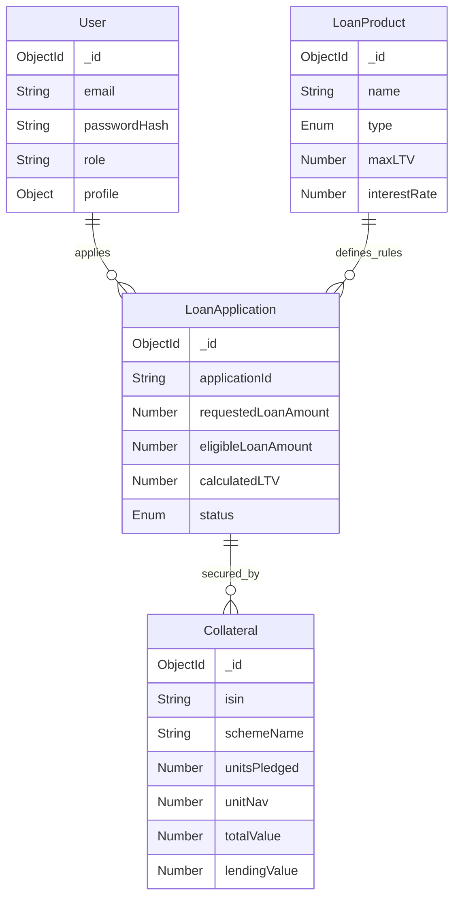

# Loan Management System (LMS) - Lending Against Mutual Funds (LAMF)

A full-stack fintech solution for managing loans secured by mutual fund collateral.

## 🚀 Tech Stack

- **Frontend:** React.js, Tailwind CSS, shadcn/ui (Architecture)
- **Backend:** Node.js, Express.js
- **Database:** MongoDB, Mongoose
- **Authentication:** JWT (JSON Web Tokens)

## 📂 Project Structure

```
LMS/
├── client/              # React Frontend
│   ├── src/
│   │   ├── components/  # Reusable UI components
│   │   ├── context/     # Auth Context
│   │   ├── pages/       # Application Pages
│   │   └── lib/         # Utilities & Axios
├── server/              # Node.js Backend
│   ├── config/          # DB Connection
│   ├── controllers/     # Business Logic
│   ├── middleware/      # Auth Middleware
│   ├── models/          # Mongoose Schemas
│   └── routes/          # API Routes
└── README.md
```

## 🛠️ Setup & Installation

### Prerequisites
- Node.js (v16+)
- MongoDB (Running locally or Atlas URI)

### 1. Backend Setup
```bash
cd server
npm install
# Create a .env file (optional, defaults provided in code for dev)
# MONGO_URI=mongodb://localhost:27017/lamf_lms
# JWT_SECRET=secret123

# Seed the Database (Creates Admin & Products)
node seeder.js

# Start Server
npm start
# Server runs on http://localhost:5000
```

### 2. Frontend Setup
```bash
cd client
npm install
npm run dev
# App runs on http://localhost:5173
```

## 🔑 Default Credentials (Seeded)

- **Borrower:** `user@example.com` / `password123`
- **Admin:** `admin@lamf.com` / `password123`

## 📡 API Documentation

### Authentication
- `POST /api/users` - Register new user
- `POST /api/users/login` - Login & Get Token
- `GET /api/users/profile` - Get current user info (Protected)

### Loan Products
- `GET /api/products` - List all available loan schemes
- `POST /api/products` - Create new product (Admin only)

### Applications
- `POST /api/applications` - Create new loan application
  - **Body:**
    ```json
    {
      "productId": "65b...",
      "requestedLoanAmount": 500000,
      "collateral": [
        {
          "schemeName": "HDFC Top 100",
          "isin": "INF...",
          "units": 1000,
          "currentNav": 150
        }
      ]
    }
    ```
- `GET /api/applications` - Get logged-in user's applications
- `GET /api/applications/:id` - Get details of a specific application

## 🗄️ Database Schema


